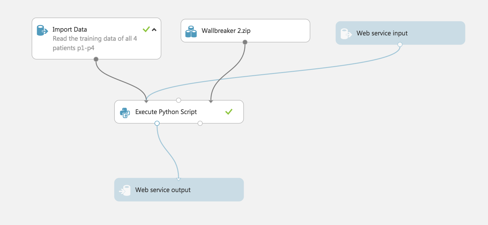

# Winning solution of the Decoding Brain Signals Cortana challenge

This data analysis challenge was organized on the Microsoft Azure ML plateform.
Data consisted in ECoG recording of 4 patients while they were presented picture of Face and House. The task was to build model achieving the highest categorization accuracy between the two type of pictures.

The experiemental protocol was identitcal to the one described in [1], but the dataset was much more challenging.

#### If you have questions about the models and the solution, open an Issue on github and i will be happy to provide more insight.

## Foreword
There is some general ideas I followed to build my models for this challenge. I will develop them here.

- **Subject specific training**. Due to the difference in electrode implantation as well as the subject specificities of the brain patterns, the best solution was to train models independently on each subjects. While it was possible to fine-tune each model for each subjects, i choose not to do it, for the sake of scalability. The models and their hyper-parameters are common for all patients, but they are trained independently on each of them.  

- **No Preprocessing**. Biosignal analysis is generally heavy in preprocessing. Common Average Reference (CAR), notch filters and Baseline correction are one of these common steps that are blindly applied in the majority of the literature. Due to the trials of test data being shuffled, i was reluctant to use continuous filtering, and filtering epoched data is generally sub-optimal (Even more in this case where the end of the epoch was still containing useful information). As a consequence, I benchmarked the use of different preprocessing methods with my pipeline and found that none of them where improving my local validation. Therefore, I chose not to apply any preprocessing of the data and directly feed the raw signal to my models.

- **Local Training and Validation**. The Azure ML studio is not very adapted for exploratory data analysis and validation of the models. Mastering the cross-validation parameters, training subject specific model and ensembling them was a difficult task to setup. I decided to work locally with python, train my model, save them on disk and upload them on the plateform to be used in the webservice. I gained in flexibility but was also limited when it comes to use advanced toolboxes and methods. The scikit-learn distibution available on Azure ML was seriously outdated, and i could not install my own packages. As a result, I did not used any fancy classifier (100% logistic-regression), because it was one of the few model that was compatible both on my machine and the Azure plateform (I could have installed a virtual-env and downgraded my scikit-learn version + heavily modified my own toolbox pyRiemann, but i was lazy).

- **Simpler is Better**. Biosignal challenges are known to be extremely prone to overfitting and can give unconsistent results across data partitions. This is due to the nature of the signals, but also to the cognitive load and level of fatigue of the subjects that can strongly modulates the signal-to-noise ratio. Under this conditions, over-tuning hyper-parameter becomes dangerous and while methods like stacking classifiers or domain adaptation can be a source of improvement, they can results in a higher instability of the model. For this challenge, the amount of data was also small, and the inter-subject variability high. So instead of going [full nuclear](https://github.com/alexandrebarachant/Grasp-and-lift-EEG-challenge) with complex solutions, I chose to stick to a subset of simple model that i will simply ensemble by averaging their probabilities.

## Solution

There is two type of brain activity to be exploited in this dataset:
- 1) [Event Related Potentials](https://en.wikipedia.org/wiki/Event-related_potential) (ERPs) : a waveform that is phase-locked with the stimulus onset. This activity is generally classified in the time domain and can be visualized by averaging all the epochs corresponding to a single class.

- 2) Induced Response (or [Neural oscillations](https://en.wikipedia.org/wiki/Neural_oscillation)): an oscillatory activity appearing shortly after the stimulus. this activity is not phase-locked and is typically extracted in the frequency domain. It can be visualized by averaging time-frequency maps of the epochs.

The final solution is a blend of 5 different models, 2 dedicated to detection of evoked potential, and 3 to induced activity. For all models, data ranging from 100ms to 400ms after the onset of the stimulation have been used. No preprocessing or artifact rejection has been applied.

Most of these models are based on my work on Riemannian Geometry. The general idea is to use covariance matrices as feature for the classification. It allows to take into account the spatial structure (through correlation between channels) of the brain patterns.

Since covariance matrices are positive and definite matrices, they have a specific structure that must be taken into account when we manipulate and compare them. This is done through the use of Riemannian Geometry. In this work, covariance matrices are mapped into their Riemannian tangent space and vectorized. This can be seen as a kernel operation that is optimal for dealing with SPD matrices.

The models used in this challenge were already available as part of the [pyRiemann](http://pythonhosted.org/pyriemann/) toolbox. Almost no custom code has been developed.

Parameters of the models were optimized to maximize the diversity of the ensemble. They have been tuned by hand, not to maximize individual performance, but to obtain the best ensembling results.

### ERPs models

#### XdawnCov

```python
clf = make_pipeline(XdawnCovariances(6, estimator='oas'),
                    TangentSpace(metric='riemann'),
                    LogisticRegression(penalty='l2'))
```

This model is essentialy the one used in the [BCI challenge 2015](https://github.com/alexandrebarachant/bci-challenge-ner-2015). It is composed of Xdawn spatial filtering [2, 3], a method that find linear combination of channel that maximize the signal to noise ratio of the Evoked response. Signal are spatially filtered and a special form covariance matrix [4, 5, 6] is estimated, projected into the Riemannian tangent space and classified by a logistic regression.

#### Xdawn

```python
clf = make_pipeline(Xdawn(12, estimator='oas'),
                    DownSampler(5),
                    EpochsVectorizer(),
                    LogisticRegression(penalty='l2'))
```

This model can be considered as the standard pipeline for classification of ERPs. Spatial filtering is applied to reduce dimension and find components that contains the evoked potential, then epochs are downsampled, vectorized and fed into a logistic regression.

### Induced activity models

#### CospCov

```python
clf = make_pipeline(CospCovariances(fs=1000, window=32, overlap=0.95, fmax=300, fmin=1),
                    CospBoostingClassifier(baseclf))
```

This model relies on cospectral covariance matrices i.e. covariances matrices are estimated in the FFT domain (using a sliding FFT window), producing one set of matrices for each frequency bins. Frequency bins ranging from 1 to 300 Hz were used, and with the FFT window of 32 samples, it produced ~ 10 different set of matrices (30 Hz bins) on which an independent classifier was applied. Output probabilities of each model were then averaged.

The classifier applied on each bin consisted in the following pipeline:

```python
baseclf = make_pipeline(ElectrodeSelection(10, metric=dict(mean='logeuclid', distance='riemann')),
                        TangentSpace(metric='riemann'),
                        LogisticRegression(penalty='l1'))
```

An electrode selection (with a criterion based on Riemannian distance [7]) procedure was used to select the 10 most relevant channel. Reduced covariance matrices were then projected in the tangent space and classified with a logistic regression.

While this can be considered as a single model, it is a bagging of independent model applied for each frequency bins. This model is one of the most robust one.

#### HankelCov

```python
clf = make_pipeline(DownSampler(2),
                    HankelCovariances(delays=[2, 4, 8, 12, 16], estimator='oas'),
                    TangentSpace(metric='logeuclid'),
                    LogisticRegression(penalty='l1'))
```

This model is inspired by the Common Spatio-spectral pattern [8] algorithm. The general idea is to build covariance matrices by concatenating time delayed trial along the channel axis (Hankel matrices). It allow to take into account the temporal information (through autocorrelation of channels) as well as spatial information. In some way, it can be linked to auto-regressive modeling of the signals.


#### CSSP

```python
clf = make_pipeline(HankelCovariances(delays=[2, 4, 8, 12, 16], estimator='oas'),
                    CSP(30),
                    LogisticRegression(penalty='l1'))
```

This model is can be seen as an indirect implementation of the CSSP algorithm [8]. It is done by feeding the well known CSP [9] spatial filtering with Hankel covariance matrices.

## Results

### Challenge

Results are evaluated using a 3-fold cross validation. The cross validation was done with no shuffling to be representative of the train/test split of the challenge.

#### Accuracy

|         | XdawnCov | Xdawn | Cosp      | HankelCov | CSSP | Ensemble |
|---------|----------|-------|-----------|-----------|------|----------|
| p1      | 85.5     | 88.0  | 89.0      | 81.5      | 76.0 | **92.5** |
| p2      | 88.0     | 88.0  | 84.0      | 68.0      | 62.5 | **94.0** |
| p3      | 90.0     | 90.0  | **100.0** | 96.5      | 88.0 | 99.0     |
| p4      | 82.5     | 76.5  | 77.6      | 80.0      | 74.5 | **83.0** |
| Average | 86.5     | 85.6  | 87.6      | 81.5      | 75.2 | **92.1** |

#### AUC

|         | XdawnCov | Xdawn | Cosp  | HankelCov | CSSP  | Ensemble  |
|---------|----------|-------|-------|-----------|-------|-----------|
| p1      | 0.934    | 0.924 | 0.968 | 0.879     | 0.824 | **0.977** |
| p2      | 0.949    | 0.949 | 0.948 | 0.746     | 0.686 | **0.973** |
| p3      | 0.976    | 0.967 | **1** | 0.995     | 0.935 | **1**     |
| p4      | 0.895    | 0.861 | 0.871 | 0.861     | 0.797 | **0.919** |
| Average | 0.939    | 0.925 | 0.947 | 0.870     | 0.811 | **0.968** |

As we can see, ensembling allow to significantly boost performance beyond what a single model can acchieve. **XdawnCov** is the best ERP model, and **Cosp** is the best induced activity model. This is actually not surprinsing since the **Cosp** model is already an enemble of several models (more robust to overfitting).


### Paper

Data from the original article [1] are public. While i did not use this dataset during the challenge, I tought it will be informative to evaluates performances of the different model on this dataset as well.

Here again, a 3-Fold cross validation was used to evaluate performances.

#### Accuracy

|         | XdawnCov | Xdawn | Cosp      | HankelCov | CSSP | Ensemble  |
|---------|----------|-------|-----------|-----------|------|-----------|
| ca      | 92.3     | 90.0  | **98.7**  | 96.0      | 81.3 | **98.7**  |
| de      | 91.0     | 95.0  | **98.0**  | 89.7      | 87.7 | 97.7      |
| fp      | 95.3     | 84.0  | **99.7**  | 96.3      | 91.3 | 97.7      |
| ja      | 94.7     | 94.7  | **99.7**  | 97.7      | 88.3 | 98.3      |
| mv      | 94.3     | 85.7  | **98.0**  | 95.7      | 89.0 | 97.0      |
| wc      | 98.7     | 97.7  | 97.3      | 95.0      | 95.0 | **99.0**  |
| zt      | 99.7     | 99.3  | **100.0** | 99.3      | 97.0 | **100.0** |
| Average | 95.1     | 92.3  | **98.8**  | 95.7      | 90.0 | 98.3      |

#### AUC

|         | XdawnCov | Xdawn | Cosp      | HankelCov | CSSP  | Ensemble  |
|---------|----------|-------|-----------|-----------|-------|-----------|
| ca      | 0.983    | 0.964 | **0.999** | 0.985     | 0.884 | **0.999** |
| de      | 0.970    | 0.987 | 0.996     | 0.953     | 0.954 | **0.999** |
| fp      | 0.993    | 0.935 | **1**     | 0.998     | 0.975 | 0.997     |
| ja      | 0.989    | 0.987 | **1**     | 0.995     | 0.949 | 0.999     |
| mv      | 0.981    | 0.936 | 0.983     | 0.984     | 0.951 | **0.994** |
| wc      | 0.998    | 0.996 | 0.996     | 0.990     | 0.990 | **0.999** |
| zt      | **1**    | 0.995 | **1**     | **1**     | 0.998 | **1**     |
| Average | 0.988    | 0.972 | 0.996     | 0.987     | 0.957 | **0.998** |

Very interestingly, the **Cosp** model achieve highest performances, and provided better accuracy than the ensembling. This results illustrates the benefits of ensembling for more challenging dataset.

The **CSSP** model was the worst performing model, and the **XdawnCov** was again the best ERP based model.

## Discussion

This ensemble of model achieved a near perfect separation of the two classes (0.998 AUC) on the 7 subject from the paper [1]. The accuracy was significantly worse on 3 of the 4 subject of the challenge dataset. Subject p4 was the most challenging, and was driving down the accuracy.

My feeling is that performances on these 4 patients can be marginally increased with more advanced models. However, it will be difficult to raise it to the level of accuracy obtained with the patients from the paper. Data were nosier, and electrodes position on the grid may not be optimal to detect the face vs. house patterns.

In this challenge, the window of analysis was limited to 400ms after the stimulus, which truncates the ERP and the induced activity. It is possible to achieve higher accuracy by increasing the window by 200ms.

A proper validation procedure was the key to develop the models. In the context of the challenge, shuffling the trials for cross validation was to avoid, since it was not promoting models that were robust to time variability of the signals.

#### Things that didn't worked
- preprocessing, bagging, stacking, domain adaptation

#### Things that could have improved the results
- longer epochs, data leak (re-ordering the trials), better model selection (without CSSP)

## Reproduce the results

To reproduce the results, you will need my toolbox pyRiemann, as well as scikit learn.

here is the 5 easy step to reproduce the solution

- 1) Download the data and place them on the root of the repository.
- 2) run the script `generate_models.py`. This should take 5 minutes on a normal laptop.
- 3) zip the content of the `models` folder and upload it to the Azure plateform
- 4) Create a new experiement reproducing the picture below using the python script `Azure_python_script.py` provided in this repo.
- 5) Enjoy.



### Cross validation

Cross validation results can be reproduced thanks to the two script `cross_validation_challenge.py` and `cross_validation_paper.py`

data from the paper [1] can be found [here](https://purl.stanford.edu/xd109qh3109)

## References

>[1] Miller, Kai J., Gerwin Schalk, Dora Hermes, Jeffrey G. Ojemann, and Rajesh PN Rao. "Spontaneous Decoding of the Timing and Content of Human Object Perception from Cortical Surface Recordings Reveals Complementary Information in the Event-Related Potential and Broadband Spectral Change." PLoS Comput Biol 12, no. 1 (2016)
>
>[2] Rivet, B., Souloumiac, A., Attina, V., & Gibert, G. (2009). xDAWN algorithm to enhance evoked potentials: application to brain-computer interface. Biomedical Engineering, IEEE Transactions on, 56(8), 2035-2043.
>
>[3] Rivet, B., Cecotti, H., Souloumiac, A., Maby, E., & Mattout, J. (2011, August). Theoretical analysis of xDAWN algorithm: application to an efficient sensor selection in a P300 BCI. In Signal Processing Conference, 2011 19th European (pp. 1382-1386). IEEE.
>
>[4] A. Barachant, M. Congedo ,”A Plug&Play P300 BCI Using Information Geometry”, arXiv:1409.0107, 2014.
>
>[5] M. Congedo, A. Barachant, A. Andreev ,”A New generation of Brain-Computer Interface Based on Riemannian Geometry”, arXiv: 1310.8115. 2013.
>
>[6] A. Barachant, M. Congedo, G. Van Veen, C. Jutten, “Classification de potentiels evoques P300 par geometrie riemannienne pour les interfaces cerveau-machine EEG”, 24eme colloque GRETSI, 2013.
>
> [7] A. Barachant and S. Bonnet, “Channel selection procedure using riemannian distance for BCI applications,” in 2011 5th International IEEE/EMBS Conference on Neural Engineering (NER), 2011, 348-351
>
> [8] Lemm, Steven, et al. "Spatio-spectral filters for improving the classification of single trial EEG." IEEE Transactions on Biomedical Engineering 52.9 (2005): 1541-1548.
>
> [9] Zoltan J. Koles, Michael S. Lazar, Steven Z. Zhou. Spatial Patterns
Underlying Population Differences in the Background EEG. Brain Topography 2(4), 275-284, 1990.
